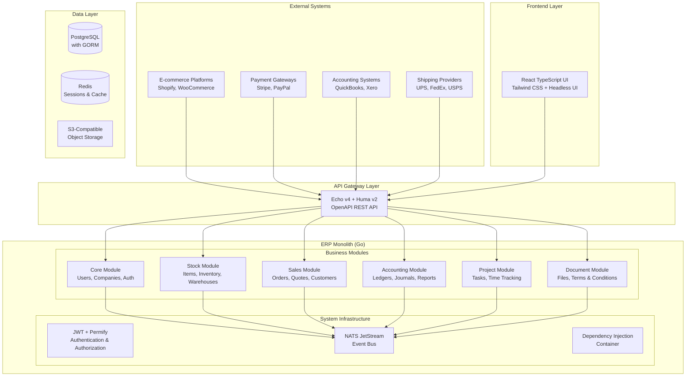
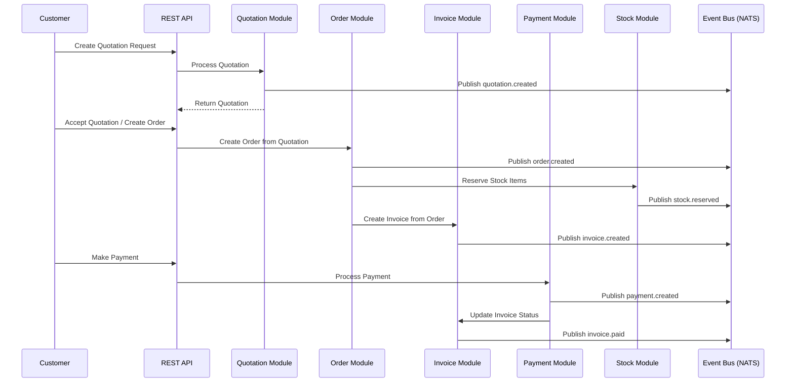
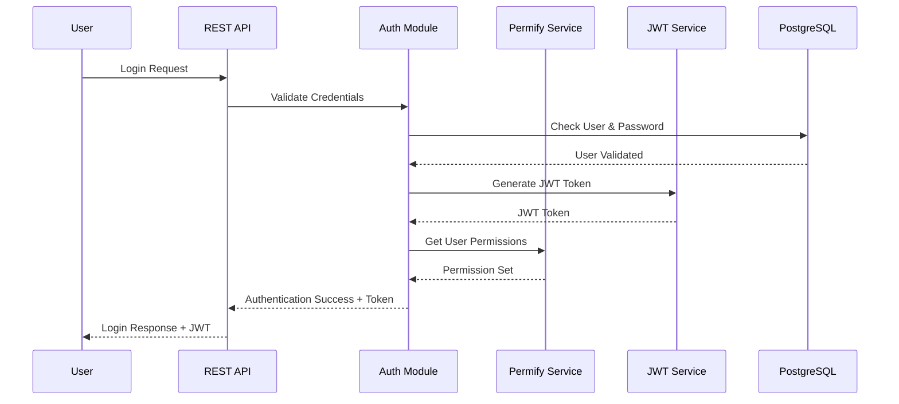

# Modular ERP System Architecture Document

## Introduction

This document outlines the overall project architecture for Modular ERP System, including backend systems, shared services, and non-UI specific concerns. Its primary goal is to serve as the guiding architectural blueprint for AI-driven development, ensuring consistency and adherence to chosen patterns and technologies.

**Relationship to Frontend Architecture:**
If the project includes a significant user interface, a separate Frontend Architecture Document will detail the frontend-specific design and MUST be used in conjunction with this document. Core technology stack choices documented herein (see "Tech Stack") are definitive for the entire project, including any frontend components.

### Starter Template or Existing Project Analysis

This is **NOT** a greenfield project. You have an existing, sophisticated Go-based ERP system with:

**Existing Project Foundation:**
- **Architecture Pattern:** Domain-driven microservices within monolith
- **Main Entry Point:** `cmd/all/main.go` - monolithic loading of modular components
- **Module Structure:** `/project/<module>` organization pattern already established
- **Core Infrastructure:** `pkg/system/` provides database, event bus, DI container
- **Technology Stack:** Go + Echo v4 + Huma v2 + PostgreSQL + GORM + NATS JetStream
- **Code Generation:** Established pipeline with GORM Gen for models and queries
- **Event Architecture:** NATS JetStream for inter-module communication

**Pre-configured Capabilities:**
- JWT authentication with Permify authorization
- Multi-tenancy support through Core module
- Event-driven architecture with defined event topics
- Database schema and migration system
- OpenAPI documentation generation
- Observability with OpenTelemetry

### Change Log
| Date | Version | Description | Author |
|------|---------|-------------|---------|
| 2025-08-04 | 1.0 | Initial architecture document creation | Claude |

## High Level Architecture

### Technical Summary

The ERP system employs a domain-driven microservices-within-monolith architecture, combining the operational simplicity of monolithic deployment with the modularity benefits of microservices design. The system leverages Go's excellent concurrency model and the existing NATS JetStream event infrastructure to enable real-time, event-driven communication between business modules (Core, Stock, Accounting, Sales/Buying, Project Management, Document Management). This architecture directly supports the PRD goals of 99.5%+ event delivery reliability while maintaining the 30-day implementation timeline through simplified deployment and unified dependency management.

### High Level Overview

**Architectural Style:** Domain-Driven Microservices within Monolith
The system maintains separate business domains as independent modules within a single deployable unit, providing modularity without distributed system complexity.

**Repository Structure:** Monorepo (as specified in PRD)
All modules reside in the existing `/project/<module>` structure with unified CI/CD, dependency management, and atomic commits across modules.

**Service Architecture:** Modular Monolith with Event-Driven Communication
Each business module operates independently, communicating through NATS JetStream events and accessing shared PostgreSQL database with clear schema boundaries.

**Primary User Flow:** Dashboard-First with Contextual Workflows
Users land on role-specific dashboards showing key metrics and pending actions, then engage with guided business workflows (quote-to-cash, inventory management) optimized for SME operational patterns.

### High Level Project Diagram



### Architectural and Design Patterns

- **Domain-Driven Design (DDD):** Clear business domain boundaries with separate modules for each domain context
- **Event-Driven Architecture:** NATS JetStream for asynchronous module communication with event sourcing
- **Repository Pattern:** Abstract data access through interfaces with GORM implementation
- **Dependency Injection:** Custom DI container managing service lifecycles and dependencies
- **CQRS (Command Query Responsibility Segregation):** Separate read and write models for complex business operations
- **Finite State Machine (FSM):** Business process flows using existing `pkg/fsm/` infrastructure

## Tech Stack

This is the DEFINITIVE technology selection section that serves as the single source of truth for all development decisions.

### Cloud Infrastructure
- **Provider:** Multi-cloud (AWS/Azure/GCP) with Kubernetes
- **Key Services:** Container Registry, Load Balancers, PostgreSQL managed service, Redis managed service
- **Deployment Regions:** Configurable based on customer requirements (US, EU, APAC)

### Technology Stack Table

| Category | Technology | Version | Purpose | Rationale |
|----------|------------|---------|---------|-----------|
| **Language** | Go | 1.21+ | Primary backend development | Excellent performance, strong typing, team expertise, concurrent processing for ERP workloads |
| **Web Framework** | Echo | v4.11+ | HTTP API framework | Lightweight, fast, extensive middleware ecosystem, production proven |
| **API Documentation** | Huma | v2.0+ | OpenAPI-first development | Auto-generated docs, type-safe handlers, excellent DX for API-first architecture |
| **Database** | PostgreSQL | 14+ | Primary data store | ACID compliance, JSON support, excellent performance for ERP workloads, existing investment |
| **ORM** | GORM | v1.25+ | Database abstraction | Strong Go ecosystem support, code generation, migration management |
| **Code Generation** | GORM Gen | Latest | Type-safe queries | Eliminates runtime query errors, improves performance, maintains existing patterns |
| **Message Queue** | NATS JetStream | v2.10+ | Event-driven messaging | High performance, clustering support, persistence, stream processing |
| **Caching** | Redis | 7.0+ | Session storage & caching | In-memory performance, pub/sub capabilities, session management |
| **Authentication** | JWT + Permify | JWT latest, Permify v0.8+ | Auth & authorization | Stateless auth, fine-grained permissions, policy-based access control |
| **Frontend Framework** | React | 18+ | User interface | Large ecosystem, TypeScript support, component reusability |
| **Frontend Language** | TypeScript | 5.3+ | Type-safe frontend | Compile-time error detection, better developer experience, API type safety |
| **Containerization** | Docker | 24+ | Application packaging | Multi-stage builds, consistent environments, platform independence |
| **Orchestration** | Kubernetes | 1.28+ | Container orchestration | Scalability, rolling deployments, service discovery, production readiness |
| **CI/CD** | GitHub Actions | Latest | Automation pipeline | Integrated with repository, extensive marketplace, cost-effective |
| **Observability** | OpenTelemetry | v1.21+ | Distributed tracing | Vendor-neutral, comprehensive observability, performance monitoring |

## Data Models

### Core Data Models

#### **Company**
**Purpose:** Central entity representing business organizations in a multi-tenant hierarchy

**Key Attributes:**
- `id`: int64 - Primary key for internal references
- `uuid`: string - External identifier for API interactions
- `name`: string - Company display name
- `code`: string - Unique company identifier/code
- `is_group`: bool - Indicates if this is a parent company
- `parent_id`: *int64 - Self-referencing hierarchy support

**Relationships:**
- Self-referencing parent-child hierarchy for company groups
- One-to-many with Users, Items, Orders, and all business entities

#### **User**
**Purpose:** Authentication and user management entity

**Key Attributes:**
- `id`: int64 - Primary key
- `uuid`: string - External user identifier
- `identifier`: string - Username/email for login
- `password_hash`: string - Encrypted password storage

**Relationships:**
- Many-to-many with Companies through workspace access
- One-to-many with Activities, Orders, and user-generated content

#### **Item**
**Purpose:** Product/service catalog entity supporting complex inventory structures

**Key Attributes:**
- `id`: int64 - Primary key
- `uuid`: string - External item identifier  
- `name`: string - Item display name
- `code`: *string - SKU or item code
- `item_type`: string - ITEM/SERVICE/BUNDLE classification
- `maintain_stock`: bool - Inventory tracking flag

**Relationships:**
- Belongs to Company
- Self-referencing for variants and bundles
- One-to-many with ItemLines, StockEntries, Prices

#### **Order**
**Purpose:** Sales and purchase order processing with full ERP workflow support

**Key Attributes:**
- `id`: int64 - Primary key
- `code`: string - Order number/reference
- `company_id`: int64 - Company ownership
- `party_id`: int64 - Customer/supplier reference
- `currency`: string - Transaction currency
- `status`: string - Order workflow state

**Relationships:**
- Belongs to Company and Party (customer/supplier)
- One-to-many with OrderLines (line items)
- Links to Invoices and StockEntries for fulfillment

## Components

### System Foundation Layer (`pkg/system/`)
**Primary Responsibility**: Provides core infrastructure services and system initialization
- **Key Interfaces**: `system.Service`, `system.Module`
- **Dependencies**: None (foundational layer)
- **Technology Specifics**: Echo v4, Huma v2, OpenTelemetry, NATS JetStream, PostgreSQL with GORM

### Business Domain Components

#### **Core Business Module** (`project/core/`)
**Primary Responsibility**: Manages foundational business entities (users, companies, contacts, addresses)
- **Key Interfaces**: Activity management, Contact management, Address management
- **Dependencies**: System foundation, Event bus
- **Sub-components**: Activity, Address, Contact, Module, Notification management

#### **Stock Management Module** (`project/stock/`)
**Primary Responsibility**: Manages inventory, items, warehouses, and stock transactions
- **Key Interfaces**: Item catalog, Inventory tracking, Warehouse management, Price lists
- **Dependencies**: Core module, Event bus, Accounting integration
- **Sub-components**: Item, Inventory, Warehouse, Price lists, Stock entries

#### **Accounting Module** (`project/accounting/`)
**Primary Responsibility**: Manages financial transactions, ledgers, and accounting processes
- **Key Interfaces**: Journal entries, Ledger management, Payment processing, Financial reporting
- **Dependencies**: Core module, Event bus
- **Sub-components**: Ledger, Journal, Payment, Cost centers, Financial reporting

## External APIs

### Payment Processing APIs

**Square API Integration** (Already partially implemented)
- **Purpose**: Credit card payment processing for sales orders
- **Authentication**: OAuth 2.0 with application credentials
- **Key Endpoints**: `/v2/payments`, `/v2/orders`, `/v2/payments/{payment_id}`

**Stripe API Integration** (Required by PRD)
- **Purpose**: Alternative payment processor with subscription support
- **Authentication**: API key-based authentication
- **Key Endpoints**: `/v1/payments/intents`, `/v1/customers`, `/v1/subscriptions`

### E-commerce Platform APIs

**Shopify Admin API** (Required by PRD)
- **Purpose**: Product catalog sync and order import from Shopify stores
- **Authentication**: OAuth 2.0 with shop-specific access tokens
- **Key Endpoints**: `/admin/api/2023-10/products.json`, `/admin/api/2023-10/orders.json`

**WooCommerce REST API** (Required by PRD)
- **Purpose**: WordPress e-commerce integration
- **Authentication**: OAuth 1.0a or Basic Auth with consumer key/secret
- **Key Endpoints**: `/wp-json/wc/v3/products`, `/wp-json/wc/v3/orders`

## Core Workflows

### Order-to-Cash Workflow



### User Authentication & Authorization Flow



## REST API Spec

### OpenAPI 3.0 Specification

```yaml
openapi: 3.0.0
info:
  title: Modular ERP System API
  version: 1.0.0
  description: Comprehensive API for modular ERP system supporting multi-tenant operations
servers:
  - url: https://api.erp-system.com/v1
    description: Production server
  - url: https://staging-api.erp-system.com/v1
    description: Staging server

components:
  securitySchemes:
    BearerAuth:
      type: http
      scheme: bearer
      bearerFormat: JWT

  schemas:
    Company:
      type: object
      required:
        - name
        - code
      properties:
        id:
          type: integer
          format: int64
          readOnly: true
        uuid:
          type: string
          format: uuid
          readOnly: true
        name:
          type: string
          minLength: 1
          maxLength: 255
        code:
          type: string
          minLength: 1
          maxLength: 50
        isGroup:
          type: boolean
          default: false
        parentId:
          type: integer
          format: int64
          nullable: true

    Item:
      type: object
      required:
        - name
        - itemType
      properties:
        id:
          type: integer
          format: int64
          readOnly: true
        uuid:
          type: string
          format: uuid
          readOnly: true
        name:
          type: string
          minLength: 1
          maxLength: 255
        code:
          type: string
          maxLength: 50
          nullable: true
        itemType:
          type: string
          enum: [ITEM, SERVICE, BUNDLE]
        maintainStock:
          type: boolean
          default: true

security:
  - BearerAuth: []

paths:
  /auth/sign-in:
    post:
      summary: User authentication
      security: []
      requestBody:
        required: true
        content:
          application/json:
            schema:
              type: object
              required:
                - identifier
                - password
              properties:
                identifier:
                  type: string
                password:
                  type: string
      responses:
        '200':
          description: Authentication successful
          content:
            application/json:
              schema:
                type: object
                properties:
                  accessToken:
                    type: string
                  refreshToken:
                    type: string
                  user:
                    $ref: '#/components/schemas/User'

  /companies:
    get:
      summary: List companies
      responses:
        '200':
          description: List of companies
          content:
            application/json:
              schema:
                type: array
                items:
                  $ref: '#/components/schemas/Company'
    post:
      summary: Create new company
      requestBody:
        required: true
        content:
          application/json:
            schema:
              $ref: '#/components/schemas/Company'
      responses:
        '201':
          description: Company created successfully
          content:
            application/json:
              schema:
                $ref: '#/components/schemas/Company'

  /items:
    get:
      summary: List items
      responses:
        '200':
          description: List of items
          content:
            application/json:
              schema:
                type: array
                items:
                  $ref: '#/components/schemas/Item'
    post:
      summary: Create new item
      requestBody:
        required: true
        content:
          application/json:
            schema:
              $ref: '#/components/schemas/Item'
      responses:
        '201':
          description: Item created successfully
          content:
            application/json:
              schema:
                $ref: '#/components/schemas/Item'
```

## Database Schema

### PostgreSQL Schema Design

```sql
-- Core System Tables
CREATE TABLE companies (
    id BIGSERIAL PRIMARY KEY,
    uuid UUID UNIQUE NOT NULL DEFAULT gen_random_uuid(),
    name VARCHAR(255) NOT NULL,
    code VARCHAR(50) UNIQUE NOT NULL,
    is_group BOOLEAN DEFAULT FALSE,
    parent_id BIGINT REFERENCES companies(id),
    created_at TIMESTAMP DEFAULT CURRENT_TIMESTAMP,
    updated_at TIMESTAMP DEFAULT CURRENT_TIMESTAMP,
    deleted_at TIMESTAMP NULL
);

CREATE INDEX idx_companies_parent_id ON companies(parent_id);
CREATE INDEX idx_companies_code ON companies(code);
CREATE INDEX idx_companies_deleted_at ON companies(deleted_at);

-- User Management
CREATE TABLE users (
    id BIGSERIAL PRIMARY KEY,
    uuid UUID UNIQUE NOT NULL DEFAULT gen_random_uuid(),
    identifier VARCHAR(255) UNIQUE NOT NULL,
    password_hash VARCHAR(255) NOT NULL,
    last_login TIMESTAMP NULL,
    created_at TIMESTAMP DEFAULT CURRENT_TIMESTAMP,
    updated_at TIMESTAMP DEFAULT CURRENT_TIMESTAMP,
    deleted_at TIMESTAMP NULL
);

CREATE INDEX idx_users_identifier ON users(identifier);
CREATE INDEX idx_users_deleted_at ON users(deleted_at);

-- Party Management (Universal Customer/Supplier Model)
CREATE TABLE parties (
    id BIGSERIAL PRIMARY KEY,
    uuid UUID UNIQUE NOT NULL DEFAULT gen_random_uuid(),
    name VARCHAR(255) NOT NULL,
    party_type VARCHAR(20) NOT NULL CHECK (party_type IN ('CUSTOMER', 'SUPPLIER', 'BOTH')),
    company_id BIGINT NOT NULL REFERENCES companies(id),
    currency VARCHAR(3) DEFAULT 'USD',
    status VARCHAR(20) DEFAULT 'ACTIVE',
    created_at TIMESTAMP DEFAULT CURRENT_TIMESTAMP,
    updated_at TIMESTAMP DEFAULT CURRENT_TIMESTAMP,
    deleted_at TIMESTAMP NULL
);

CREATE INDEX idx_parties_company_id ON parties(company_id);
CREATE INDEX idx_parties_type ON parties(party_type);
CREATE INDEX idx_parties_status ON parties(status);

-- Stock Management
CREATE TABLE items (
    id BIGSERIAL PRIMARY KEY,
    uuid UUID UNIQUE NOT NULL DEFAULT gen_random_uuid(),
    name VARCHAR(255) NOT NULL,
    code VARCHAR(50) NULL,
    company_id BIGINT NOT NULL REFERENCES companies(id),
    group_id BIGINT NULL REFERENCES groups(id),
    parent_id BIGINT NULL REFERENCES items(id),
    item_type VARCHAR(20) NOT NULL CHECK (item_type IN ('ITEM', 'SERVICE', 'BUNDLE')),
    maintain_stock BOOLEAN DEFAULT TRUE,
    unit_of_measure_id BIGINT REFERENCES unit_of_measures(id),
    status VARCHAR(20) DEFAULT 'ENABLED',
    created_at TIMESTAMP DEFAULT CURRENT_TIMESTAMP,
    updated_at TIMESTAMP DEFAULT CURRENT_TIMESTAMP,
    deleted_at TIMESTAMP NULL
);

CREATE INDEX idx_items_company_id ON items(company_id);
CREATE INDEX idx_items_code ON items(code);
CREATE INDEX idx_items_type ON items(item_type);
CREATE INDEX idx_items_parent_id ON items(parent_id);

-- Sales & Purchase Management
CREATE TABLE orders (
    id BIGSERIAL PRIMARY KEY,
    uuid UUID UNIQUE NOT NULL DEFAULT gen_random_uuid(),
    code VARCHAR(50) NOT NULL,
    company_id BIGINT NOT NULL REFERENCES companies(id),
    party_id BIGINT NOT NULL REFERENCES parties(id),
    currency VARCHAR(3) NOT NULL DEFAULT 'USD',
    status VARCHAR(20) NOT NULL DEFAULT 'DRAFT',
    posting_date DATE NOT NULL DEFAULT CURRENT_DATE,
    delivery_date DATE NULL,
    project_id BIGINT NULL REFERENCES projects(id),
    cost_center_id BIGINT NULL REFERENCES cost_centers(id),
    price_list_id BIGINT NULL REFERENCES price_lists(id),
    total_amount DECIMAL(15,2) DEFAULT 0.00,
    created_at TIMESTAMP DEFAULT CURRENT_TIMESTAMP,
    updated_at TIMESTAMP DEFAULT CURRENT_TIMESTAMP,
    deleted_at TIMESTAMP NULL
);

CREATE INDEX idx_orders_company_id ON orders(company_id);
CREATE INDEX idx_orders_party_id ON orders(party_id);
CREATE INDEX idx_orders_status ON orders(status);
CREATE INDEX idx_orders_posting_date ON orders(posting_date);

-- Accounting Schema
CREATE TABLE ledger_accounts (
    id BIGSERIAL PRIMARY KEY,
    uuid UUID UNIQUE NOT NULL DEFAULT gen_random_uuid(),
    name VARCHAR(255) NOT NULL,
    code VARCHAR(50) NOT NULL,
    company_id BIGINT NOT NULL REFERENCES companies(id),
    parent_id BIGINT NULL REFERENCES ledger_accounts(id),
    account_type VARCHAR(50) NOT NULL,
    is_group BOOLEAN DEFAULT FALSE,
    balance DECIMAL(15,2) DEFAULT 0.00,
    created_at TIMESTAMP DEFAULT CURRENT_TIMESTAMP,
    updated_at TIMESTAMP DEFAULT CURRENT_TIMESTAMP,
    deleted_at TIMESTAMP NULL,
    UNIQUE(company_id, code)
);

CREATE INDEX idx_ledger_accounts_company_id ON ledger_accounts(company_id);
CREATE INDEX idx_ledger_accounts_parent_id ON ledger_accounts(parent_id);
CREATE INDEX idx_ledger_accounts_type ON ledger_accounts(account_type);
```

## Source Tree

```
erp-project/
├── erp/                                    # Go Backend (Modular Monolith)
│   ├── cmd/                               # Application entry points
│   │   ├── all/                          # Main monolith entry (loads all modules)
│   │   │   ├── main.go                   # Primary application entry
│   │   │   └── internal/
│   │   ├── app/                          # Alternative single-app entry
│   │   └── nats/                         # NATS server entry
│   │
│   ├── project/                          # Business Domain Modules
│   │   ├── accounting/                   # Financial management
│   │   │   ├── ledger/
│   │   │   │   ├── handler/
│   │   │   │   │   ├── rest/             # REST API endpoints
│   │   │   │   │   └── event/            # Domain event handlers
│   │   │   │   ├── repository/           # Data access layer
│   │   │   │   ├── usecase/              # Business logic
│   │   │   │   └── module.go             # Module registration
│   │   │   └── module.go
│   │   │
│   │   ├── stock/                        # Inventory management
│   │   │   ├── item/
│   │   │   ├── warehouse/
│   │   │   ├── stock_entry/
│   │   │   └── module.go
│   │   │
│   │   ├── core/                         # Core system functionality
│   │   │   ├── activity/
│   │   │   ├── address/
│   │   │   ├── contact/
│   │   │   └── module.go
│   │   │
│   │   └── selling/                      # Sales operations
│   │       ├── customer/
│   │       └── module.go
│   │
│   ├── pkg/                              # Shared packages (reusable)
│   │   ├── system/                       # Core system infrastructure
│   │   ├── db/                           # Database utilities
│   │   ├── di/                           # Dependency injection
│   │   ├── bus/                          # Event bus
│   │   └── logger/                       # Logging utilities
│   │
│   ├── gen/                              # Generated code (DO NOT EDIT)
│   │   ├── db/
│   │   │   ├── model/                    # GORM generated models
│   │   │   └── query/                    # GORM generated queries
│   │   └── mocks/                        # Generated test mocks
│   │
│   ├── configs/                          # Configuration files
│   │   └── config.json                   # Main configuration
│   │
│   ├── docs/                             # Documentation
│   │   ├── prd.md                        # Product requirements
│   │   └── backend-architecture.md       # This document
│   │
│   ├── go.mod                            # Go module definition
│   └── Makefile                          # Build and development tasks
│
└── web/                                   # React Frontend (Future)
    ├── src/
    │   ├── modules/                      # Domain-specific modules
    │   │   ├── accounting/
    │   │   ├── stock/
    │   │   └── selling/
    │   └── shared/                       # Shared frontend utilities
    └── package.json
```

## Infrastructure and Deployment

### Deployment Strategy

**Container Strategy:**
- Docker containerization with multi-stage builds for optimized image sizes
- Single container deployment leveraging the modular monolith architecture
- Health checks and graceful shutdown handlers built into containers

**Orchestration Platform:**
- Kubernetes as the primary orchestration platform
- Helm charts for templated deployments and configuration management
- Support for both cloud-managed (EKS, GKE, AKS) and on-premises Kubernetes clusters

### Environment Configuration

**Environment Hierarchy:**
1. **Development** - Local Docker Compose + Kubernetes (optional)
2. **Staging** - Full Kubernetes deployment with production-like data
3. **Production** - High-availability Kubernetes with redundancy

**CI/CD Pipeline:**
- GitHub Actions workflow with code quality, build/package, and deployment stages
- Automated testing, security scanning, and deployment to staging
- Manual approval for production deployments

### Rollback Procedures

**Application Rollback:**
- Helm rollback commands for immediate application version reversion
- Database migration rollbacks using GORM's down migrations
- Automated rollback triggers based on health check failures

## Error Handling Strategy

### Error Classification System

**Domain Errors** (Business Logic)
- Validation Errors: Invalid input data, business rule violations
- State Errors: Invalid state transitions in FSM workflows
- Authorization Errors: Permission denied, insufficient privileges

**Infrastructure Errors** (System Level)
- Database Errors: Connection failures, constraint violations, query timeouts
- Network Errors: Service unavailable, timeout, connection refused
- External Service Errors: Third-party API failures, integration issues

### Error Handling Patterns

**Layered Error Handling**
```go
// Domain Layer - Business Errors
type DomainError struct {
    Code    string
    Message string
    Details map[string]interface{}
}

// Application Layer - Wrapping with Context
func (uc *UserUseCase) CreateUser(ctx context.Context, req CreateUserRequest) error {
    if err := uc.validator.Validate(req); err != nil {
        return fmt.Errorf("validation failed: %w", err)
    }
    return nil
}
```

### Logging Standards

**Structured Logging Implementation**
- Zerolog as primary logging backend for performance and structured output
- OpenTelemetry integration for distributed tracing correlation
- No sensitive data in logs, with data masking for PII

## Coding Standards

### Core Standards
- **Languages & Runtimes:** Go 1.21+, TypeScript 5.0+
- **Style & Linting:** Use `gofmt`, `golangci-lint` for Go; ESLint + Prettier for TypeScript
- **Test Organization:** Go tests in `*_test.go` files alongside source

### Critical Rules
- **Database Access:** All database queries must use the repository pattern with generated GORM models from `gen/db/`
- **API Response Format:** All REST endpoints must use the standard response wrapper
- **Event Publishing:** Domain events must be published through the event bus
- **Module Registration:** New modules must be registered in `cmd/all/main.go`
- **Generated Code:** Never manually edit files in `gen/db/` - always regenerate with `make models`

## Test Strategy and Standards

### Testing Philosophy
- **Approach:** Test-Driven Development (TDD) with comprehensive test automation
- **Coverage Goals:** Minimum 80% code coverage for unit tests, 70% for integration tests
- **Test Pyramid:** 70% unit tests, 20% integration tests, 10% end-to-end tests

### Test Types and Organization

#### Unit Tests
- **Framework:** Go native testing framework with Testify v1.8+
- **File Convention:** `*_test.go` files alongside source code
- **Mocking Library:** Testify/mock and GoMock for interface mocking
- **Coverage Requirement:** Minimum 80% line coverage

#### Integration Tests
- **Scope:** Database interactions, NATS messaging, HTTP API endpoints
- **Location:** `tests/integration/` directory
- **Test Infrastructure:** Testcontainers PostgreSQL for realistic database testing

#### End-to-End Tests
- **Framework:** Playwright v1.40+ for web UI testing
- **Scope:** Critical user journeys across frontend and backend
- **Environment:** Dedicated test environment with clean data

## Security

### Existing Security Infrastructure

**Authentication System:**
- JWT-based authentication with multi-tenant scoping via company_id
- Refresh token rotation with secure storage and transmission
- Session management integrated with Redis for scalability

**Authorization Framework:**
- Permify integration providing fine-grained, policy-based access control
- Role-based access control (RBAC) with hierarchical role inheritance
- Resource-level permissions with dynamic policy evaluation

**Data Protection:**
- Multi-tenant data isolation through company_id foreign key constraints
- Encryption at rest using PostgreSQL built-in encryption capabilities
- TLS 1.3 for all network communications between services

### Security Requirements for New Features

**Authentication Integration:**
- All new endpoints MUST implement JWT token validation middleware
- Company-scoped authentication ensuring users only access authorized tenant data
- Consistent error handling for authentication failures (401 Unauthorized)

**Authorization Implementation:**
- Mandatory Permify permission checks for all business operations
- Resource-based authorization using entity IDs and user context
- Graceful degradation for authorization service unavailability

**Data Classification and Encryption:**
- PII data MUST be encrypted using application-level encryption before database storage
- Financial data requires additional audit logging with immutable transaction records
- Sensitive fields (passwords, tokens, API keys) MUST never appear in logs or error messages

## Next Steps

The architecture document is now complete and ready to guide development activities. This document should be reviewed with the Product Owner and used as the foundation for:

1. **Story Implementation** - Begin implementation with development agent using this architectural guidance
2. **Infrastructure Setup** - Deploy infrastructure using DevOps agent following the deployment strategy
3. **Frontend Development** - Create frontend architecture document for React application development
4. **Integration Development** - Implement external API integrations as documented

**For AI Development Agents:**
- Follow the coding standards section explicitly for all code generation
- Use the database schema as the definitive data model reference
- Implement all new features following the established modular patterns
- Ensure all code adheres to the error handling and security requirements

This architecture provides a comprehensive blueprint for building a scalable, maintainable, and secure ERP system that balances modern development practices with operational simplicity.