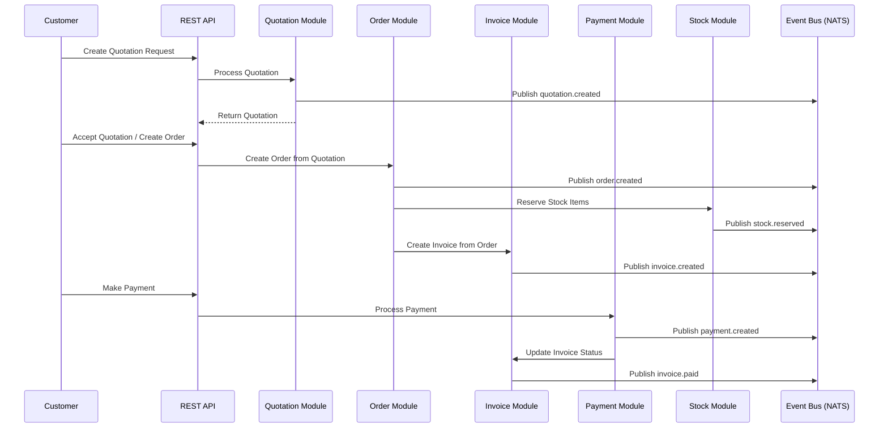
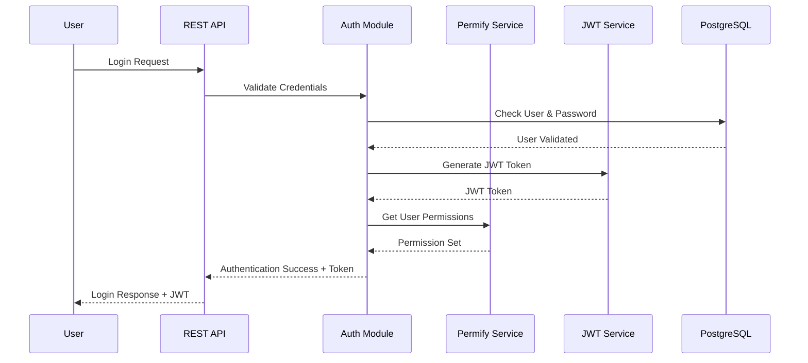

# Core Workflows

## Order-to-Cash Workflow

```mermaid
sequenceDiagram
    participant C as Customer
    participant API as REST API
    participant Q as Quotation Module
    participant O as Order Module
    participant I as Invoice Module
    participant P as Payment Module
    participant S as Stock Module
    participant E as Event Bus (NATS)
    
    C->>API: Create Quotation Request
    API->>Q: Process Quotation
    Q->>E: Publish quotation.created
    Q-->>API: Return Quotation
    
    C->>API: Accept Quotation / Create Order
    API->>O: Create Order from Quotation
    O->>E: Publish order.created
    O->>S: Reserve Stock Items
    S->>E: Publish stock.reserved
    
    O->>I: Create Invoice from Order
    I->>E: Publish invoice.created
    
    C->>API: Make Payment
    API->>P: Process Payment
    P->>E: Publish payment.created
    P->>I: Update Invoice Status
    I->>E: Publish invoice.paid
```

## User Authentication & Authorization Flow

```mermaid
sequenceDiagram
    participant U as User
    participant API as REST API
    participant Auth as Auth Module
    participant Permify as Permify Service
    participant JWT as JWT Service
    participant DB as PostgreSQL
    
    U->>API: Login Request
    API->>Auth: Validate Credentials
    Auth->>DB: Check User & Password
    DB-->>Auth: User Validated
    
    Auth->>JWT: Generate JWT Token
    JWT-->>Auth: JWT Token
    
    Auth->>Permify: Get User Permissions
    Permify-->>Auth: Permission Set
    
    Auth-->>API: Authentication Success + Token
    API-->>U: Login Response + JWT
```
