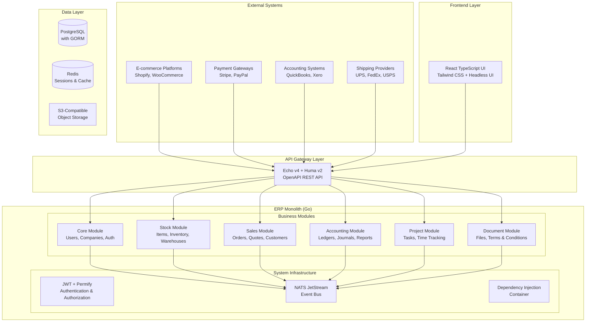

# High Level Architecture

## Technical Summary

The ERP system employs a domain-driven microservices-within-monolith architecture, combining the operational simplicity of monolithic deployment with the modularity benefits of microservices design. The system leverages Go's excellent concurrency model and the existing NATS JetStream event infrastructure to enable real-time, event-driven communication between business modules (Core, Stock, Accounting, Sales/Buying, Project Management, Document Management). This architecture directly supports the PRD goals of 99.5%+ event delivery reliability while maintaining the 30-day implementation timeline through simplified deployment and unified dependency management.

## High Level Overview

**Architectural Style:** Domain-Driven Microservices within Monolith
The system maintains separate business domains as independent modules within a single deployable unit, providing modularity without distributed system complexity.

**Repository Structure:** Monorepo (as specified in PRD)
All modules reside in the existing `/project/<module>` structure with unified CI/CD, dependency management, and atomic commits across modules.

**Service Architecture:** Modular Monolith with Event-Driven Communication
Each business module operates independently, communicating through NATS JetStream events and accessing shared PostgreSQL database with clear schema boundaries.

**Primary User Flow:** Dashboard-First with Contextual Workflows
Users land on role-specific dashboards showing key metrics and pending actions, then engage with guided business workflows (quote-to-cash, inventory management) optimized for SME operational patterns.

## High Level Project Diagram

## Architectural and Design Patterns

- **Domain-Driven Design (DDD):** Clear business domain boundaries with separate modules for each domain context
- **Event-Driven Architecture:** NATS JetStream for asynchronous module communication with event sourcing
- **Repository Pattern:** Abstract data access through interfaces with GORM implementation
- **Dependency Injection:** Custom DI container managing service lifecycles and dependencies
- **CQRS (Command Query Responsibility Segregation):** Separate read and write models for complex business operations
- **Finite State Machine (FSM):** Business process flows using existing `pkg/fsm/` infrastructure
